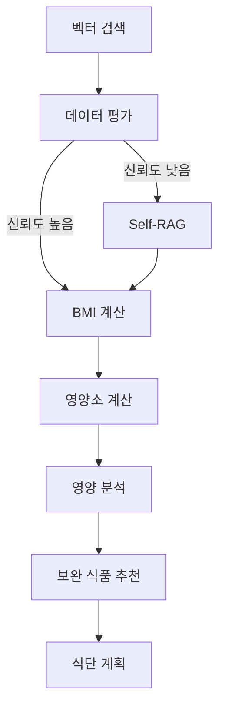

# 식단 계획 AI 에이전트
식품 데이터 csv를 벡터에 저장- 멀티 벡터로 나누어서 식품 이름으로 벡터 유사도로 한다. 
전국통합식품영양성분정보표준데이터
SentenceTransformer로 임베딩
이 프로젝트는 LangGraph를 활용하여 사용자의 영양 목표와 선호도를 고려한 맞춤형 식단을 추천하는 AI 에이전트입니다.
### 1. LangGraph 워크플로우


### 2. 도구 (@tool)
- `search_food_info`: 음식 정보 검색
- `calculate_bmr`: 기초대사량 계산
- `calculate_tdee`: 일일 총 에너지 소비량 계산
- `analyze_nutrition`: 영양소 분석
- `generate_meal_plan`: 맞춤형 식단 생성

### 3. 노드 구성
- `vector_search_node`: Qdrant를 사용한 벡터 검색
- `evaluate_data_node`: 데이터 신뢰도 평가
- `self_rag_node`: 추가 정보 검색
- `bmi_calculation_node`: BMI 계산
- `nutrition_calculation_node`: 영양소 계산
- `nutrition_analysis_node`: 영양 분석
- `recommend_supplements_node`: 보완 식품 추천
- `meal_planning_node`: 식단 계획 생성
## 주요 기능

### 1. 영양소 분석 및 계산
- 기초대사량(BMR) 계산
- 일일 총 에너지 소비량(TDEE) 계산
- BMI 계산 및 상태 판정
- 목표에 따른 칼로리 조정
- 영양소 비율 계산 (단백질 30%, 탄수화물 40%, 지방 30%)

### 2. 식품 정보 검색
- Qdrant 벡터 DB를 활용한 식품 정보 검색
- 네이버 검색을 통한 실시간 영양소 정보 수집
- Self-RAG를 통한 추가 정보 보완

  
### 3. 맞춤형 식단 추천
- 사용자 목표에 맞는 식단 계획 생성
- 부족한 영양소 보완 식품 추천
- 영양 균형을 고려한 식사 구성

### 4. 시각화 및 분석
- 영양소 분포 파이 차트
- BMI 변화 추이 그래프
- 끼니별 칼로리 분포 막대 그래프
- 영양 분석 보고서 생성

## 설치 방법

### 1. 시스템 요구사항
- Python 3.8 이상
- Docker (Qdrant 실행용)
- Chrome 브라우저 (네이버 크롤링용)

### 2. 저장소 클론 및 가상환경 설정
```bash
# 저장소 클론
git clone [repository-url]
cd [repository-name]

# 가상환경 생성 및 활성화
python -m venv venv
source venv/bin/activate  # Linux/Mac
venv\Scripts\activate     # Windows
```

### 3. 필요한 패키지 설치
```bash
pip install -r requirements.txt
```

### 4. 환경 변수 설정
`.env` 파일을 생성하고 다음 내용을 추가:
```
OPENAI_API_KEY=your-api-key
```

## 실행 방법

### 1. Qdrant 서버 실행
```bash
docker run -p 6333:6333 qdrant/qdrant
```

### 2. 프로그램 실행
```bash
python main.py
```

### 3. 입력 예시
```python
initial_state = {
    "user_data": {
        "height": 170,  # cm
        "weight": 70,   # kg
        "age": 30,
        "gender": "male",
        "activity_level": "moderate",
        "goal": "체중 감량",
        "target_foods": ["닭가슴살", "현미", "브로콜리"]
    }
}
```

## 프로젝트 구조

```
food_agent/
├── __init__.py
├── nodes.py          # 워크플로우 노드 정의
├── tools.py          # LangGraph 도구 및 유틸리티
├── prompts.py        # LLM 프롬프트 템플릿
├── utils.py          # 유틸리티 함수
└── workflow.py       # 워크플로우 정의
```

### 주요 파일 설명

#### 1. nodes.py
- `nutrition_calculation_node`: 영양소 요구사항 계산
- `meal_planning_node`: 맞춤형 식단 생성
- `vector_search_node`: 벡터 DB 검색
- `evaluate_data_node`: 데이터 신뢰도 평가
- `self_rag_node`: 추가 정보 검색
- `bmi_calculation_node`: BMI 계산
- `nutrition_analysis_node`: 영양소 분석
- `recommend_supplements_node`: 보완 식품 추천

#### 2. tools.py
- `search_food_info`: 음식 정보 검색
- `calculate_bmr`: 기초대사량 계산
- `calculate_tdee`: 일일 총 에너지 소비량 계산
- `analyze_nutrition`: 영양소 분석
- `generate_meal_plan`: 맞춤형 식단 생성
- 시각화 도구들 (nutrition_distribution, bmi_trend, meal_calories)

#### 3. nodes.py
- 각 워크플로우 노드의 구체적인 구현
- 상태 관리 및 데이터 처리 로직

#### 4. prompts.py
- LLM에 사용되는 프롬프트 템플릿 정의
- 시스템 메시지 및 사용자 입력 형식 지정 
- `NUTRITION_ANALYSIS_PROMPT`: 영양 분석 프롬프트
- `SUPPLEMENT_RECOMMENDATION_PROMPT`: 보완 식품 추천 프롬프트
- `MEAL_PLANNING_PROMPT`: 식단 계획 생성 프롬프트
## 요구사항
#### 5. workflow.py
- LangGraph 워크플로우 정의
- 노드 간의 연결 및 조건부 라우팅 설정
- 프록시 설정 및 LLM 초기화


- Python 3.8 이상
- Docker (Qdrant 실행용)
- Chrome 브라우저 (네이버 크롤링용)
- 필수 패키지:
  - langchain
  - langgraph
  - qdrant-client
  - beautifulsoup4
  - matplotlib
  - seaborn

## 데이터 흐름

1. 사용자 입력 처리
   - 신체 정보 (키, 체중, 나이, 성별)
   - 활동 수준
   - 목표 (감량/유지/증량)
   - 식품 선호도

2. 데이터 수집 및 검증
   - 벡터 DB에서 식품 정보 검색
   - 데이터 신뢰도 평가
   - 필요한 경우 Self-RAG로 정보 보완

3. 영양소 계산
   - BMR/TDEE 계산
   - BMI 계산 및 상태 판정
   - 목표에 따른 칼로리 조정
   - 영양소 비율 설정 (단백질 30%, 탄수화물 40%, 지방 30%)

4. 식단 생성
   - 영양소 분석
   - 부족한 영양소 파악
   - 보완 식품 추천
   - 최종 식단 계획 생성

5. 결과 출력
   - 영양 분석 보고서
   - 시각화 자료
   - 상세 식단 정보

## 주의사항

1. API 키 관리
   - OpenAI API 키는 반드시 환경 변수로 관리
   - API 키를 코드에 직접 입력하지 않음

2. 데이터 신뢰성
   - 벡터 DB의 데이터는 주기적으로 업데이트 필요
   - 웹 크롤링 결과는 검증 후 사용

3. 리소스 사용
   - Qdrant 서버는 충분한 메모리 필요
   - LLM API 호출 횟수 모니터링 필요

## 문제 해결

1. 한글 폰트 관련 문제
   - Windows: Malgun Gothic 폰트 설치 확인
   - Linux/Mac: 나눔고딕 폰트 설치 필요

2. API 연결 문제
   - 프록시 설정 확인
   - API 키 유효성 확인
   - 네트워크 연결 상태 확인

3. 데이터베이스 연결 문제
   - Qdrant 서버 실행 상태 확인
   - 포트 충돌 확인
   - Docker 컨테이너 상태 확인 